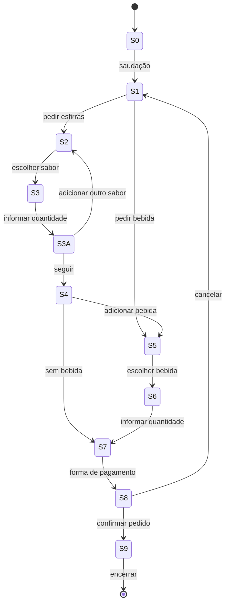

# Chatbot Esfirras AJ com Autômato Finito Determinístico (DFA)

## 1) Resumo do Tema
**Título:** Chatbot de Pedidos para Esfirras AJ com Autômato Finito Determinístico (DFA)  
**Objetivo:** Apresentar um fluxo de atendimento automatizado utilizando um DFA que conduz o cliente desde a saudação até a finalização do pedido.
O autômato organiza o processo em etapas como: seleção da esfirra,sabor da esfirra, escolha da quantidade, seleção de bebida, confirmação do pedido, coleta do endereço e conclusão.
Cada estado define uma ação específica, garantindo uma interação estruturada, clara e eficiente.

---

## 2) Diagrama de Estados (Mermaid)

---

## 3) Tabela de Estados e Transições

| Estado | Nome | Descrição |
|--------|-----------------|----------------|
|S0     |Início	             |Aguarda saudação                  | 
|S1     |Menu	             |Mostra opções (esfirra ou bebida) |
|S2     |Escolha esfirra     |Cliente escolhe sabor             |
|S3     |Quantidade esfirra  |Cliente informa quantidade        |
|S4     |Pergunta bebida     |Oferece bebidas                   |
|S5     |Escolha bebida	     |Cliente escolhe bebida            |
|S6     |Quantidade bebida   |Cliente informa quantidade        |
|S7     |Forma de pagamento  |Pergunta forma de pagamento       |
|S8     |Confirmação final   |Confirma tudo                     |
|S9     |Finalização	     |Encerra                           |

---

## 4) Exemplo de Diálogo
Chatbot iniciado! Diga 'Oi' para começar.
Você: Boa Noite

Bot: Olá! Bem-vindo à Esfirras J&A! Você quer pedir esfirras ou bebidas?
Você: Esfirras

Bot: Temos sabores: carne, queijo, frango, calabresa, chocolate. Qual sabor deseja primeiro?
Você: Carne 
Bot: Quantas esfirras de carne?
Você: 5

Bot: Deseja adicionar outro sabor? (Sim/Não)
Você: sim

Bot: Qual outro sabor deseja adicionar?
Você: Frango
Bot: Quantas esfirras de frango?
Você: 2

Bot: Deseja adicionar outro sabor? (Sim/Não)
Você: Sim

Bot: Qual outro sabor deseja adicionar?
Você: Queijo
Bot: Quantas esfirras de queijo?
Você: 1

Bot: Deseja adicionar outro sabor? (Sim/Não)
Você: Não

Bot: Deseja adicionar bebida ao pedido? (Sim/Não)
Você: Sim
Bot: Temos bebidas: coca-cola, guarana, tampico, suco, agua, agua-com-gás. Qual deseja?
Você: Coca-cola
Bot: Quantas unidades de coca-cola?
Você: 2

Bot: Qual será a forma de pagamento? (Pix, Cartão ou Dinheiro)
Você: Pix

Bot: 
Resumo do Pedido:
- 5 esfirra(s) de carne
- 2 esfirra(s) de frango
- 1 esfirra(s) de queijo
- 2 unidade(s) de coca-cola
Forma de pagamento: Pix
Confirmar pedido? (Sim/Não)
Você: Sim

Bot: Pedido confirmado! Muito obrigado. Para encerrar, digite: Sim
Você: Sim

Bot: Nos da J&A agradecemos pela preferência! Volte sempre!

---

## 5) Código em Java

```java
import java.text.Normalizer;
import java.util.*;
import java.util.stream.Collectors;

public class ChatbotEsfirrasDFA {

    private String state = "S0";

    // === Agora são listas para permitir vários sabores ===
    private List<String> saboresPedido = new ArrayList<>();
    private List<Integer> quantidadesPedido = new ArrayList<>();

    private String bebida = null;
    private Integer qtdBebida = null;
    private String pagamento = null;

    private List<String> sabores = Arrays.asList("carne", "queijo", "frango", "calabresa", "chocolate");
    private List<String> bebidasLista = Arrays.asList("coca-cola", "guarana", "tampico", "suco", "agua","agua-com-gás");

    public String transition(String entrada) {

        String raw = entrada == null ? "" : entrada.trim();
        String e = normalize(raw);

        // =====================
        // S0 – Saudação
        // =====================
        if (state.equals("S0")) {
            if (containsAny(e, "oi", "ola", "ola", "bom dia", "boa tarde", "boa noite")) {
                state = "S1";
                return "Olá! Bem-vindo à Esfirras J&A! Você quer pedir esfirras ou bebidas?";
            }
        }

        // =====================
        // S1 – Pedido inicial
        // =====================
        if (state.equals("S1")) {
            if (e.contains("esfirra")) {
                state = "S2";
                return "Temos sabores: " + String.join(", ", sabores) + ". Qual sabor deseja primeiro?";
            } else if (containsAny(e, "bebida", "beber")) {
                state = "S5";
                return "Temos bebidas: " + String.join(", ", bebidasLista) + ". Qual deseja?";
            } else {
                return "No momento só trabalhamos com pedidos de esfirras ou bebidas.";
            }
        }

        // =====================
        // S2 – Escolha de sabor
        // =====================
        if (state.equals("S2")) {

            List<String> saboresNorm = sabores.stream().map(this::normalize).collect(Collectors.toList());

            if (saboresNorm.contains(e)) {
                String saborEscolhido = sabores.get(saboresNorm.indexOf(e));
                saboresPedido.add(saborEscolhido);
                state = "S3";
                return "Quantas esfirras de " + saborEscolhido + "?";
            } else {
                return "Sabor inválido. Escolha entre: " + String.join(", ", sabores);
            }
        }

        // =====================
        // S3 – Quantidade de um sabor
        // =====================
        if (state.equals("S3")) {
            try {
                int qtd = Integer.parseInt(raw);
                if (qtd <= 0) return "Digite um número positivo.";

                quantidadesPedido.add(qtd);

                state = "S3A";
                return "Deseja adicionar outro sabor? (Sim/Não)";

            } catch (NumberFormatException ex) {
                return "Digite um número válido.";
            }
        }

        // =====================
        // S3A – Deseja mais um sabor?
        // =====================
        if (state.equals("S3A")) {
            if (containsAny(e, "sim", "s")) {
                state = "S2";
                return "Qual outro sabor deseja adicionar?";
            } else if (containsAny(e, "nao", "não", "n")) {
                state = "S4";
                return "Deseja adicionar bebida ao pedido? (Sim/Não)";
            } else {
                return "Responda apenas com Sim ou Não.";
            }
        }

        // =====================
        // S4 – Deseja bebida?
        // =====================
        if (state.equals("S4")) {
            if (containsAny(e, "sim", "s")) {
                state = "S5";
                return "Temos bebidas: " + String.join(", ", bebidasLista) + ". Qual deseja?";
            } else if (containsAny(e, "nao", "não", "n")) {
                state = "S7";
                return "Qual será a forma de pagamento? (Pix, Cartão ou Dinheiro)";
            } else {
                return "Responda apenas com Sim ou Não.";
            }
        }

        // =====================
        // S5 – Escolha de bebida
        // =====================
        if (state.equals("S5")) {
            List<String> bebidasNorm = bebidasLista.stream().map(this::normalize).collect(Collectors.toList());

            if (bebidasNorm.contains(e)) {
                bebida = bebidasLista.get(bebidasNorm.indexOf(e));
                state = "S6";
                return "Quantas unidades de " + bebida + "?";

            } else {
                return "Bebida inválida. Escolha entre: " + String.join(", ", bebidasLista);
            }
        }

        // =====================
        // S6 – Quantidade da bebida
        // =====================
        if (state.equals("S6")) {
            try {
                qtdBebida = Integer.parseInt(raw);
                if (qtdBebida <= 0) return "Digite um número positivo.";

                state = "S7";
                return "Qual será a forma de pagamento? (Pix, Cartão ou Dinheiro)";

            } catch (NumberFormatException ex) {
                return "Digite um número válido.";
            }
        }

        // =====================
        // S7 – Pagamento
        // =====================
        if (state.equals("S7")) {

            if (containsAny(e, "pix", "cartao", "cartão", "dinheiro")) {
                pagamento = raw;
                state = "S8";

                StringBuilder resumo = new StringBuilder("\nResumo do Pedido:\n");

                for (int i = 0; i < saboresPedido.size(); i++) {
                    resumo.append("- ").append(quantidadesPedido.get(i))
                          .append(" esfirra(s) de ").append(saboresPedido.get(i)).append("\n");
                }

                if (bebida != null) {
                    resumo.append("- ").append(qtdBebida)
                          .append(" unidade(s) de ").append(bebida).append("\n");
                }

                resumo.append("Forma de pagamento: ").append(pagamento)
                      .append("\nConfirmar pedido? (Sim/Não)");

                return resumo.toString();
            }

            return "Forma de pagamento inválida. Escolha: Pix, Cartão ou Dinheiro.";
        }

        // =====================
        // S8 – Confirmar
        // =====================
        if (state.equals("S8")) {

            if (containsAny(e, "sim", "s")) {
                state = "S9";
                return "Pedido confirmado! Muito obrigado. Para encerrar, digite: Sim";

            } else if (containsAny(e, "nao", "não", "n")) {
                resetPedido();
                state = "S1";
                return "Pedido cancelado. Deseja pedir algo?";
            }

            return "Responda apenas com Sim ou Não.";
        }

        // =====================
        // S9 – Encerramento
        // =====================
        if (state.equals("S9")) {
            if (containsAny(e, "sim", "s")) {
                return "Nos da J&A agradecemos pela preferência! Volte sempre!";
            } else {
                return "Digite 'Sim' para encerrar.";
            }
        }

        return "Não entendi. Pode repetir?";
    }

    private void resetPedido() {
        saboresPedido.clear();
        quantidadesPedido.clear();
        bebida = null;
        qtdBebida = null;
        pagamento = null;
    }

    private String normalize(String s) {
        if (s == null) return "";
        String n = Normalizer.normalize(s, Normalizer.Form.NFD);
        n = n.replaceAll("\\p{M}", "");
        return n.toLowerCase().trim();
    }

    private boolean containsAny(String e, String... termos) {
        for (String t : termos) {
            if (e.contains(normalize(t))) return true;
        }
        return false;
    }

    public static void main(String[] args) {
        Scanner sc = new Scanner(System.in);
        ChatbotEsfirrasDFA bot = new ChatbotEsfirrasDFA();

        System.out.println("Chatbot iniciado! Diga 'Oi' para começar.");

        while (true) {
            System.out.print("Você: ");
            String entrada = sc.nextLine();

            String resposta = bot.transition(entrada);
            System.out.println("Bot: " + resposta);

            if (resposta.equals("Nos da J&A agradecemos pela preferência! Volte sempre!")) break;
        }

        sc.close();
    }
}
